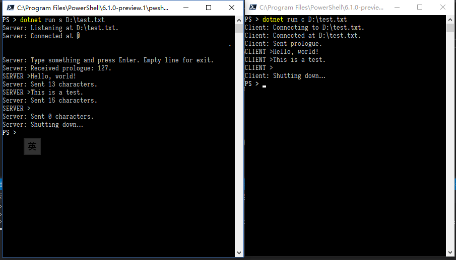

# UnixDomainSocketTest

This repos contains some test code for the newly-introduced [`UnixDomainSocketEndPoint`](https://docs.microsoft.com/zh-cn/dotnet/api/system.net.sockets.unixdomainsocketendpoint?view=netcore-2.1) in .NET Core 2.1 Preview. It contains a simple pair of socket-based server & client.

You can either execute the application to run the server, client, or both in the same console.

See the comments in the source code above the `Main` method for the instruction on command line arguments.